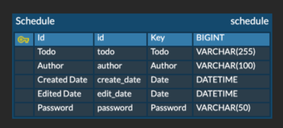

# schedule-project
Java를 사용한 일정 관리 앱 과제입니다.

Lvl 0 부터 Lvl 4, Lvl 6이 별도의 브랜치에  나뉘어 있습니다.

## API:
https://mango-mountain-50c.notion.site/1c0f1ccea86a80a2bf1def8b324ea303?v=1c0f1ccea86a8015a717000c4d7763bc

## ERD:

## 과제 단계:
### Lvl 0
- API 명세서와 ERD 작성
- MySQL에 schedule 테이블 생성

### Lvl 1
- 일정 생성
- 일정 단건 조회
- 일정 다건 조회 (작성자명, 수정일 필터)

### Lvl2
- 일정의 할일, 작성자 수정
- 일정 삭제

### Lvl3
- 작성자 테이블 추가
- 작성자 아이디로 일정 검색

### Lvl4
(미완)
- 일정 조회시 작성자 이름 포함

### Lvl6
- 유효성 검사 추가
